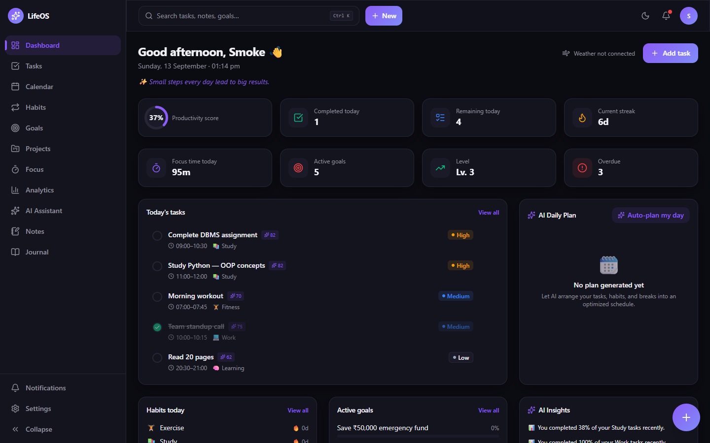
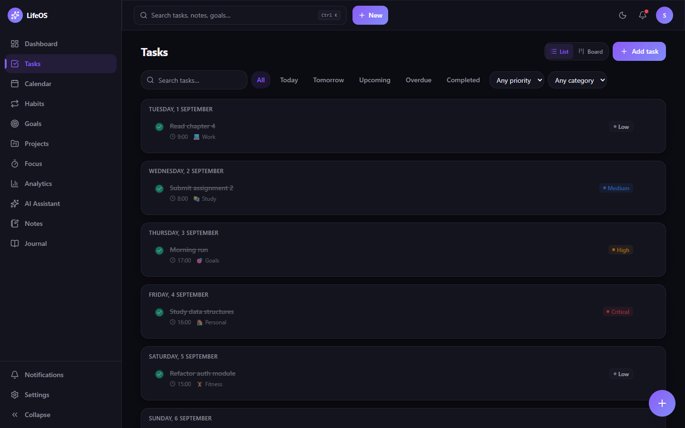
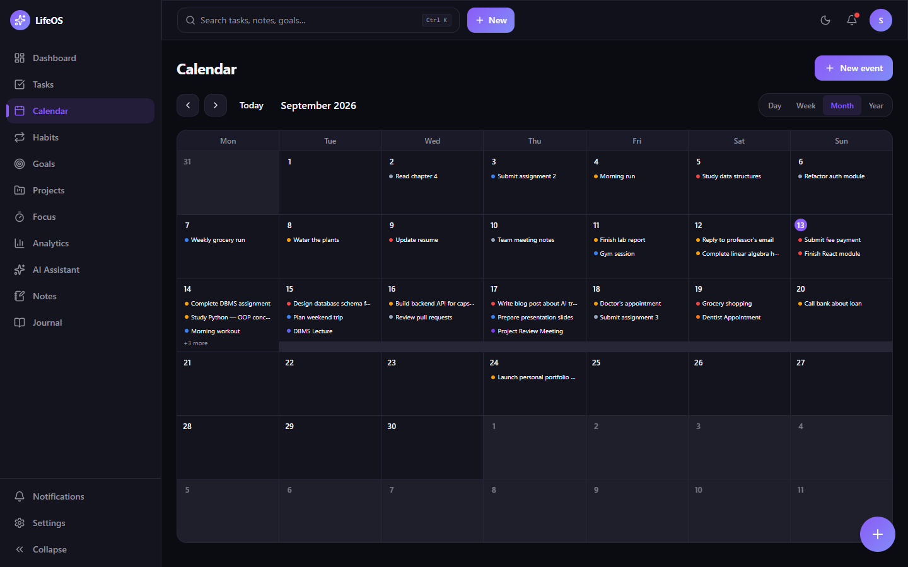
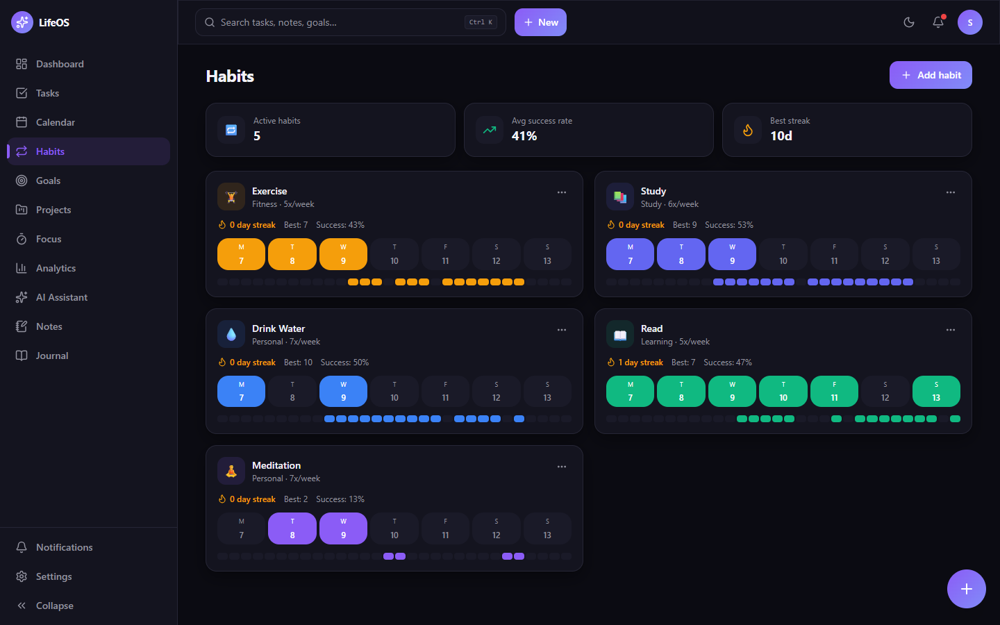
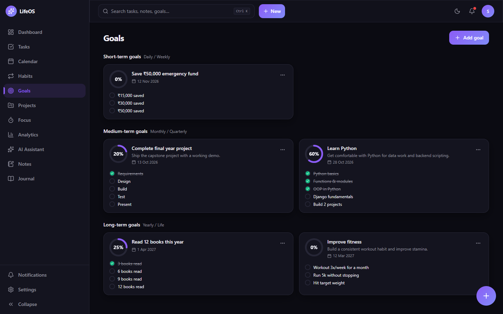
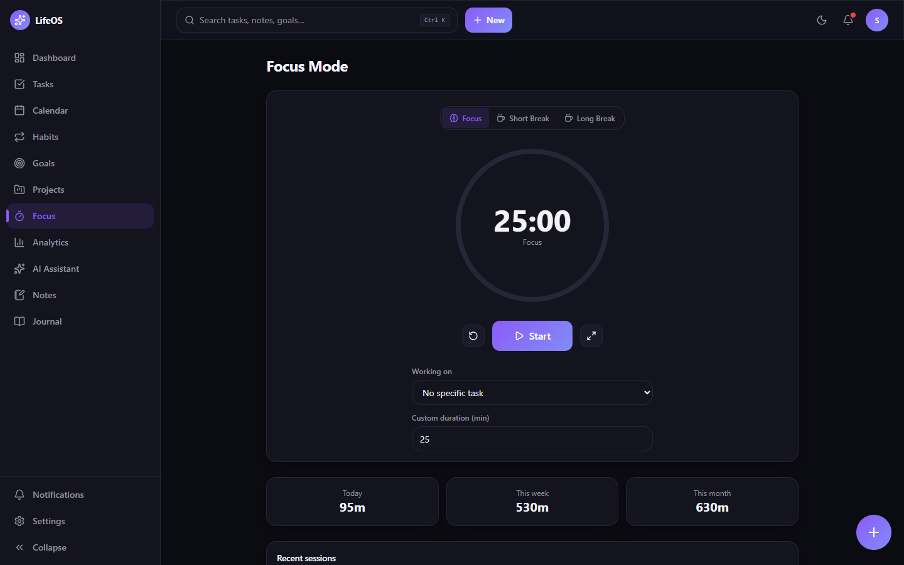
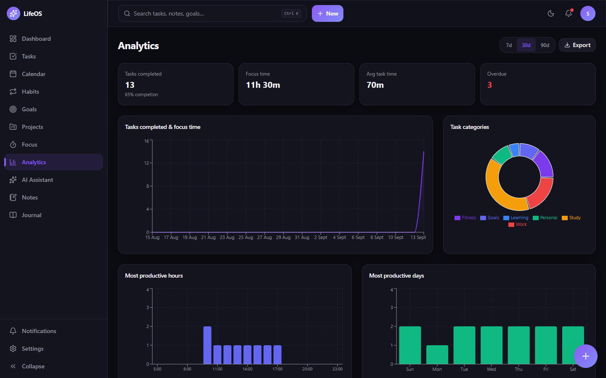
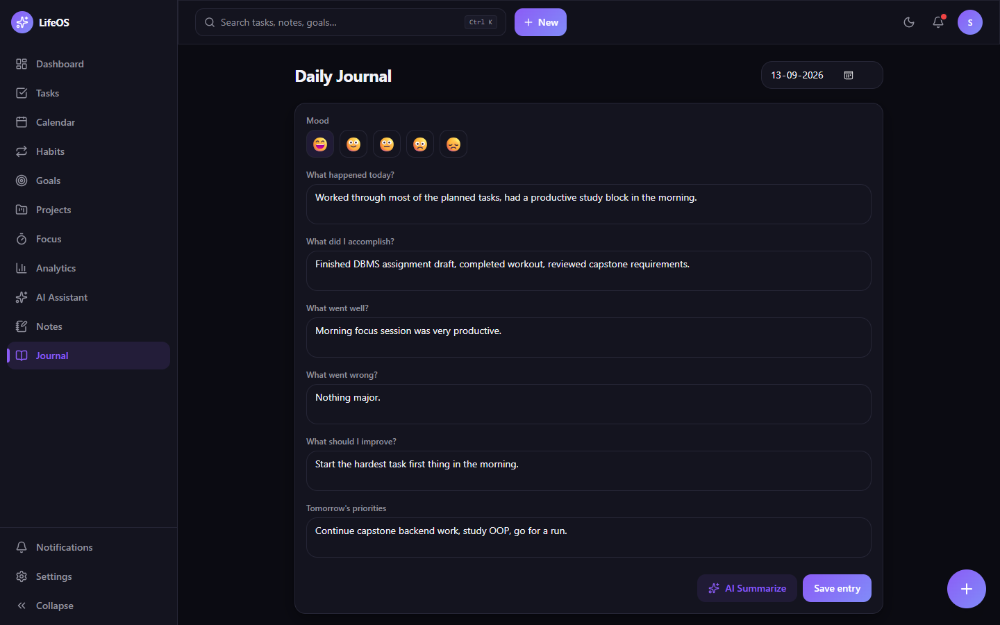
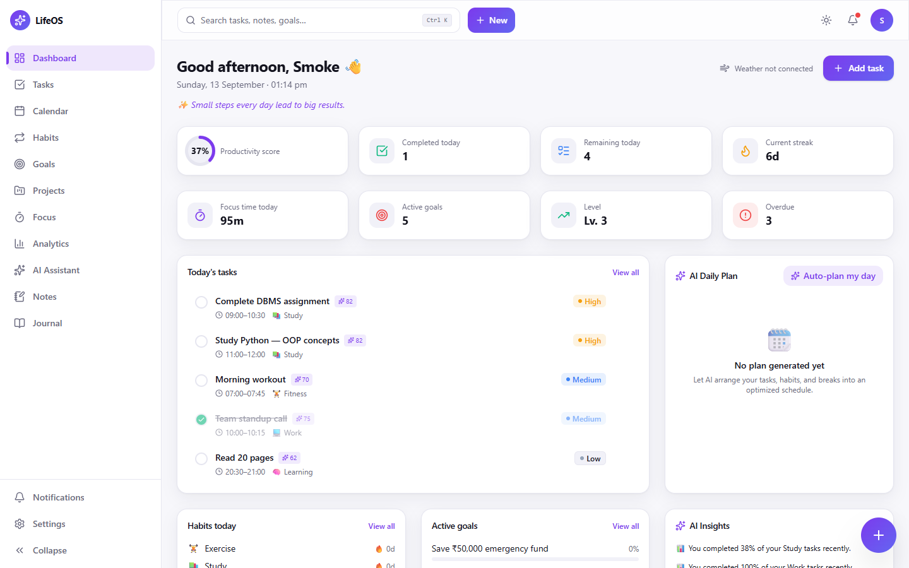

<div align="center">

# LifeOS

**An AI-powered daily task & life management OS — tasks, calendar, habits, goals, focus, analytics, journaling, and an assistant that actually acts on your data.**

[](https://nextjs.org)
[](https://react.dev)
[](https://www.typescriptlang.org)
[](https://tailwindcss.com)
[](https://nodejs.org/api/sqlite.html)
[](#deploying)



</div>

## Why LifeOS

Most to-do apps are a list. LifeOS is the whole loop: capture in plain
English, let the planner lay out your day around fixed events, track the
habits and goals behind the tasks, run focus sessions, and see real
analytics about how you actually work.

- **Type, don't fill forms** — "Finish DBMS assignment tomorrow 9am high priority #study" becomes a fully-populated task (chrono-node powered parsing).
- **An assistant that does things** — the chat can create, reschedule, break down, and prioritise tasks, plan your day, and summarise progress — against your real data.
- **Works with zero API keys** — every AI feature has a deterministic rule-based engine behind it; add an OpenAI-compatible key when you want a real LLM.
- **Zero infrastructure** — Node's built-in SQLite. `npm run dev` and you're in. No Postgres, no Redis, no auth SaaS.
- **Everything is real** — analytics, streaks, XP, and insights are computed from your history. Integrations that aren't wired up say "not connected" instead of showing fake data.
- **Installable PWA** — offline task/habit capture queued via IndexedDB and synced on reconnect; light/dark themes; keyboard-first with `Ctrl/Cmd+K`.

See [FEATURES.md](./FEATURES.md) for an honest map of what's fully
functional, what's simplified, and what's a placeholder.

## Screenshots

| Tasks (list + Kanban) | Calendar |
|---|---|
|  |  |

| Habits | Goals |
|---|---|
|  |  |

| Focus mode | Analytics |
|---|---|
|  |  |

| Journal | Dashboard (light) |
|---|---|
|  |  |

## Tech stack

Next.js 16 (App Router, Turbopack) · React 19 · TypeScript · Tailwind CSS v4 ·
Radix UI · NextAuth v5 (JWT, bcrypt) · Node `node:sqlite` · zustand · SWR ·
react-hook-form + zod · dnd-kit · Recharts · framer-motion · chrono-node ·
Playwright (smoke tests)

## Quick start

```bash
npm install
cp .env.example .env.local   # then edit NEXTAUTH_SECRET at minimum
npm run dev
```

Open [http://localhost:3000](http://localhost:3000), click **Create an
account**, keep "Populate with sample tasks, habits & goals" checked, and
you'll land on a fully populated dashboard. You can erase any (or all) of
that data at any time from Settings → Data → Reset data, and start fresh.

Requires **Node.js 22.5+** (LifeOS uses Node's built-in `node:sqlite`
module, which needs 22.5 or newer — check with `node -v`).

## How data is stored

LifeOS ships with a zero-config **embedded SQLite database** (Node's
built-in `node:sqlite`) — there is no external database to install for
local development or to try this project out. The file lives at
`./data/lifeos.db` and is created automatically on first run.

All database access goes through `src/lib/db/repositories/*` — nothing
else touches SQL directly. This means swapping storage engines (e.g. for a
multi-instance production deployment) is a contained change:

1. Run [`docs/postgres-schema.sql`](./docs/postgres-schema.sql) against a
   PostgreSQL database.
2. Replace `src/lib/db/client.ts` with a `pg`-backed client exposing the
   same shape.
3. Set `DATABASE_URL` in your environment.

The repositories were written with this migration in mind (parameterized
queries, one file per domain, no SQLite-specific SQL beyond `client.ts`).

## Environment variables

Copy `.env.example` to `.env.local` and fill in what you need:

| Variable | Required | Purpose |
|---|---|---|
| `NEXTAUTH_SECRET` | Yes | Signs session JWTs. Generate with `openssl rand -base64 32`. |
| `AUTH_TRUST_HOST` | Yes (self-hosted) | Set to `true` when not deploying on Vercel. |
| `NEXTAUTH_URL` | Production | Public URL of your deployment. |
| `AI_API_KEY`, `AI_MODEL`, `AI_BASE_URL` | No | Connect a real OpenAI-compatible LLM. Every AI feature works without these via the built-in rule-based engine (see below). |
| `WEATHER_API_KEY` | No | Powers the dashboard weather widget (OpenWeatherMap). Without it, the widget shows "not connected" — LifeOS never fabricates weather data. |
| `DATABASE_URL` | No | Only used if you migrate to PostgreSQL (see above). |
| `LIFEOS_DATA_DIR` | No | Directory for the SQLite file (default `./data`). The Docker image sets it to `/app/data` — mount your volume there. |

## AI setup

LifeOS's AI features — natural-language task creation, task breakdown,
priority scoring, the auto day-planner, productivity insights, and the
chat assistant — are implemented as a **provider-agnostic service layer**
(`src/lib/ai/*`):

- `src/lib/ai/provider.ts` calls an OpenAI-compatible chat completions API
  when `AI_API_KEY` is set.
- Every AI feature also has a **deterministic rule-based fallback**
  (`nlTaskParser.ts` uses `chrono-node` for date/time extraction,
  `taskBreakdown.ts` uses keyword-matched project templates,
  `priorityScoring.ts` and `productivityScore.ts` are weighted formulas,
  `dayPlanner.ts` is a greedy scheduling algorithm, `insights.ts` computes
  real statistics from your task/focus/habit history).

This means the product is **fully functional AI-wise with zero API keys**
— useful for demos, offline use, and predictable behavior — while staying
one env var away from a real LLM. To connect one:

```bash
AI_API_KEY=sk-...
AI_MODEL=gpt-4o-mini
AI_BASE_URL=https://api.openai.com/v1
```

Any OpenAI-compatible endpoint works (OpenAI, Azure OpenAI, local
llama.cpp/Ollama servers with an OpenAI-compatible shim, etc.) — just
point `AI_BASE_URL` at it.

## Scripts

```bash
npm run dev             # start the dev server (Turbopack)
npm run build            # production build
npm run start             # run the production build
npm run lint                # ESLint
npm run smoke-test          # Playwright smoke test: register → visit every page
npm run smoke-test:demo     # same, with demo data seeded (heavier data set)
```

The smoke tests require a running server (`npm run start` or `npm run dev`
in another terminal) and Chromium available at the path in
`scripts/smoke-test.mjs` — adjust `executablePath` if Playwright's browser
lives elsewhere on your machine, or just run `npx playwright install
chromium` and remove the explicit `executablePath`.

## Building for production

```bash
npm run build
npm run start
```

`next build` type-checks the whole project and will fail the build on
type errors. The SQLite database file is created next to wherever the
process runs (`./data/lifeos.db`) — make sure that directory is writable
and persisted across deploys (mount a volume) if you stick with SQLite in
production, or migrate to PostgreSQL for multi-instance/serverless
deployments (see "How data is stored").

## Deploying

LifeOS is a single stateful Node process with an embedded SQLite file, so
it deploys anywhere you can run a container with a persistent disk. The
repo ships a multi-stage [`Dockerfile`](./Dockerfile) (Next standalone
output, non-root, ~150 MB image) and a [`railway.json`](./railway.json).

### Railway (recommended)

```bash
npm i -g @railway/cli
railway login
railway init --name lifeos                    # create the project
railway add --service lifeos                  # create the service
railway volume add -m /app/data --service lifeos   # persistent disk for the SQLite file
railway variables --service lifeos \
  --set "NEXTAUTH_SECRET=$(openssl rand -base64 32)" \
  --set "AUTH_TRUST_HOST=true"
railway up --service lifeos                   # builds the Dockerfile and deploys
railway domain --service lifeos               # mint a public *.up.railway.app URL
railway variables --service lifeos --set "NEXTAUTH_URL=https://<your-domain>"
```

Railway detects `railway.json`, builds the `Dockerfile`, mounts the volume
at `/app/data` (which is what `LIFEOS_DATA_DIR` points at in the image),
and health-checks `/login`. Keep it at **one replica** — SQLite is
single-writer.

### Any Docker host (Fly.io, Render, a VPS, …)

```bash
docker build -t lifeos .
docker run -d -p 3000:3000 \
  -v lifeos-data:/app/data \
  -e NEXTAUTH_SECRET="$(openssl rand -base64 32)" \
  -e AUTH_TRUST_HOST=true \
  -e NEXTAUTH_URL="https://your.domain" \
  lifeos
```

The only thing that must survive a redeploy is the `/app/data` volume.

### Vercel / serverless

SQLite on an ephemeral filesystem won't persist and Next's serverless
functions can't share a writable disk. Migrate to PostgreSQL first (see
["How data is stored"](#how-data-is-stored)), then deploy normally — Vercel
sets `NEXTAUTH_URL` and trusts its own host automatically.

## Project structure

```
src/
  app/
    (app)/            # authenticated app shell: dashboard, tasks, calendar, ...
    api/               # REST API route handlers (one folder per resource)
    login/, register/  # auth pages
  components/
    layout/            # Sidebar, Topbar, BottomNav, CommandPalette, QuickAddFAB
    tasks/, calendar/, habits/, goals/, focus/, notes/, projects/, ...
    ui/                # Button, Card, Dialog, Input, Badge, ProgressRing, ...
  lib/
    ai/                # AI service layer (provider + rule-based engine)
    db/
      repositories/    # all database access — one file per domain
      schema.sql       # SQLite schema
      client.ts        # node:sqlite connection + schema bootstrap
      seedDemoData.ts  # realistic demo data for new accounts
    integrations/       # provider interfaces + stubs for future connectors
    store/              # zustand UI state (modals, command palette, sidebar)
  hooks/
  types/                 # shared TypeScript domain types
docs/
  postgres-schema.sql    # production Postgres schema
public/
  manifest.webmanifest, sw.js, icons/   # PWA
```

## Future integrations

`src/lib/integrations/` defines clean interfaces (`CalendarProvider`,
`TaskProvider`, `MessagingProvider`) for Google Calendar, Outlook, Google
Tasks, Notion, Todoist, WhatsApp, and Telegram, with two reference stubs.
None of them fabricate data — see
[`src/lib/integrations/README.md`](./src/lib/integrations/README.md) for
how to activate a real one. Voice input, wearable data, geofencing, and
team collaboration are left as data-model/UI placeholders pending product
decisions (see that file for details).

## Demo account

Registering with "Populate with sample tasks, habits & goals" checked
seeds a realistic account: an in-progress capstone project, a mix of
today's/upcoming/overdue tasks, three weeks of habit history, five goals
across all three terms, notes, five days of journal entries, ten days of
focus session history, and starter notifications/badges/XP — so every
screen has something meaningful to show immediately.

## Resetting data

Settings → Data → **Reset data** lets a user erase their own data at any
time and start over — no re-registration needed:

- **Erase everything** — wipes every task, habit, goal, project, calendar
  event, note, journal entry, focus session, notification, and
  XP/streak/badge, restores the default categories, and returns the account
  to a blank slate (with an option to repopulate it with sample data
  instead of leaving it empty).
- **Erase selected data** — pick just the categories to clear (e.g. only
  Tasks, or only Habits + Focus history) and leave the rest untouched.

Both actions require typed/click confirmation since they're irreversible,
and only ever touch the signed-in user's own rows
(`src/lib/db/repositories/reset.ts`, `POST /api/settings/reset`).
